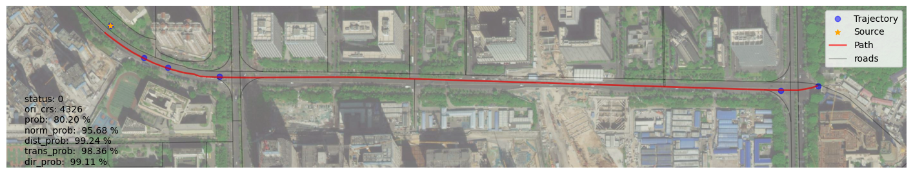
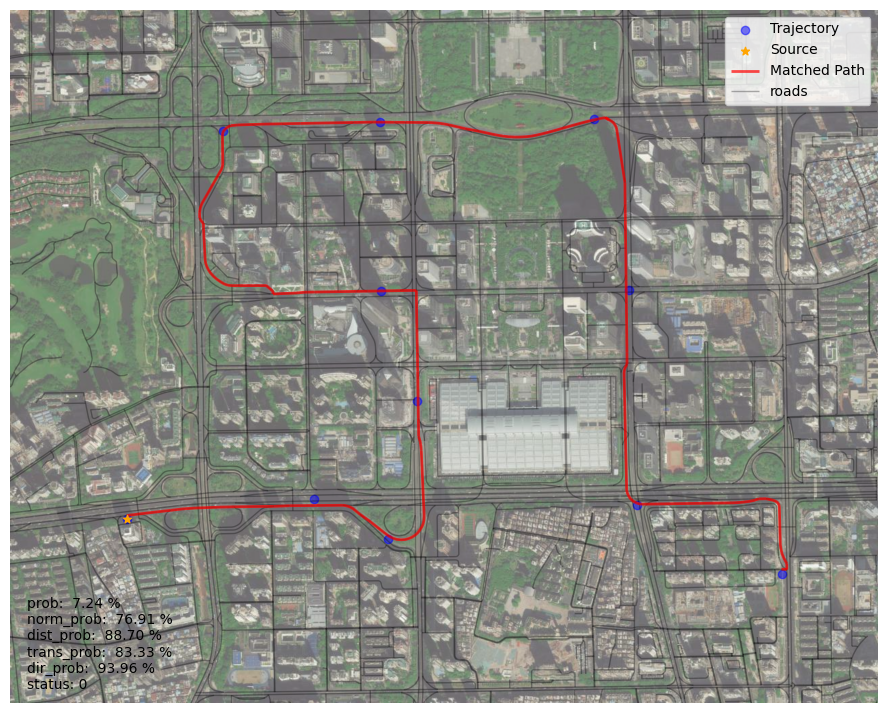

# ST-MapMatching

## 版本

V2.0.0

## 描述

基于时间和空间特性的全局地图匹配算法（ST-Matching），一种针对低采样率的GPS轨迹的新颖全局地图匹配算法。算法的基础路网信息源为 [OSM](https://wiki.openstreetmap.org/wiki/Main_Page)，可通过`DigraphOSM`自动下载。算法匹配过程考虑以下两个方面特征：

1. 道路网络的空间几何和拓扑结构

2. 轨迹的速度/时间约束。基于时空分析，构建候选图，从中确定最佳匹配路径。

输入WGS坐标系的`GPS轨迹点集`，输出途径的路段；

本算法为 MSRA《[Map-Matching for Low-Sampling-Rate GPS Trajectories](https://www.microsoft.com/en-us/research/publication/map-matching-for-low-sampling-rate-gps-trajectories/)》的复现，并根据自己的认识有一些改动，中文解读可参考 [CSDN文章](https://blog.csdn.net/qq_43281895/article/details/103145327)。

## 调用说明

详见 `demo.py`

```python
from mapmatching import build_geograph, ST_Matching

"""step 1: 获取/加载路网"""
# 方法1：
# 根据 bbox 从 OSM 下载路网，从头解析获得路网数据
# net = build_geograph(bbox=[113.930914, 22.570536, 113.945456, 22.585613],
#                      xml_fn="./data/network/LXD.osm.xml", ll=False)
# 将预处理路网保存为 ckpt
# net.save_checkpoint('./data/network/LXD_graph.ckpt')

# 方法2：
# 使用预处理路网 
net = build_geograph(ckpt='./data/network/LXD_graph.ckpt')

"""step 2: 创建地图匹配 matcher"""
matcher = ST_Matching(net=net, ll=False)

"""step 3: 加载轨迹点集合，以打石一路为例"""
idx = 4
traj = matcher.load_points(f"./data/trajs/traj_{idx}.geojson").reset_index(drop=True)
res = matcher.matching(traj, top_k=5, dir_trans=True, details=False, plot=True,
                       simplify=True, debug_in_levels=False)

# 后续步骤可按需选择
"""step 4: 将轨迹点映射到匹配道路上"""
path = matcher.transform_res_2_path(res, ori_crs=True)
proj_traj = matcher.project(traj, path)

"""step 5: eval"""
matcher.eval(traj, res, resample=5, eps=10)
```

### 输入示例

```json
{
"type": "FeatureCollection",
"name": "traj_debug_dashiyilu_0",
"crs": { "type": "name", "properties": { "name": "urn:ogc:def:crs:OGC:1.3:CRS84" } },
"features": [
{ "type": "Feature", "properties": {"geometry": { "type": "Point", "coordinates": [ 113.931956598012064, 22.575930582940785 ] } }},
{ "type": "Feature", "properties": {"geometry": { "type": "Point", "coordinates": [ 113.932515057750763, 22.575632036146079 ] } }},
{ "type": "Feature", "properties": {"geometry": { "type": "Point", "coordinates": [ 113.932920306714124, 22.575490522559665 ] } }},
{ "type": "Feature", "properties": {"geometry": { "type": "Point", "coordinates": [ 113.933781789624888, 22.575346314537452 ] } }},
{ "type": "Feature", "properties": {"geometry": { "type": "Point", "coordinates": [ 113.943190113338488, 22.575121559997108 ] } }},
{ "type": "Feature", "properties": {"geometry": { "type": "Point", "coordinates": [ 113.943816093693101, 22.575196482404341 ] } }}
]
}

```

注:

1. 示例输入对应`./data/trajs/traj_4.geojson`，其中 `geometry` 为唯一需要提供的字段，在`vscode`中可借助插件`Geo Data Viewer`可视化;
2. 输入轨迹点的坐标系默认为 `wgs84`, `gcj02` 的轨迹需在调用函数`load_points`明确坐标系`in_sys='gcj'`;
3. 提供的预处理路网仅覆盖深圳南山区万科云城片区，并没有完成覆盖`./data/trajs`中所有的测试用例。 若需测试所有用例，需自行调整 bbox 获取相应区域的路网。

### 输出示例

#### demo 输出

```python
{
  #  输出状态码，0 为正常输出
  'status': 0, 
  # 匹配路段 index
  'epath': [123, 124, 125, 126, 127, 128, 129, 130, 131, 132, 133, 134, 135], 
  # 第一条路被通过的比例(即第一条路上, 第一个轨迹点及之后的部分的占比)
  'step_0': 0.7286440473726905, 
  # 最后一条路被通过的比例(即最后一条路上, 最后一个轨迹点及之前的部分的占比）
  'step_n': 0.8915310605450645，
  # 概率
  'probs': {
      'prob': 0.9457396931471692, 
      'norm_prob': 0.9861498301181256,
      'dist_prob': 0.9946361835772438,
      'trans_prob': 0.9880031610906268,
      'dir_prob': 0.9933312073337599}
 }
```

可视化效果如下:
  


 - matcher.matching 将 plot 参数设置为 True
 - 瓦片地图，需要安装 [Tilemap](https://github.com/wenke727/TileMap)

#### 其他地图匹配效果

`./data/trajs/traj_0.geojson` 匹配效果




## 环境安装

详见 requirement.txt, 建议`geopandas`使用conda安装

```bash
conda create -n stmm python=3.9
conda activate stmm
conda install -c conda-forge geopandas==0.12.2
pip install -r requirement.txt
```

