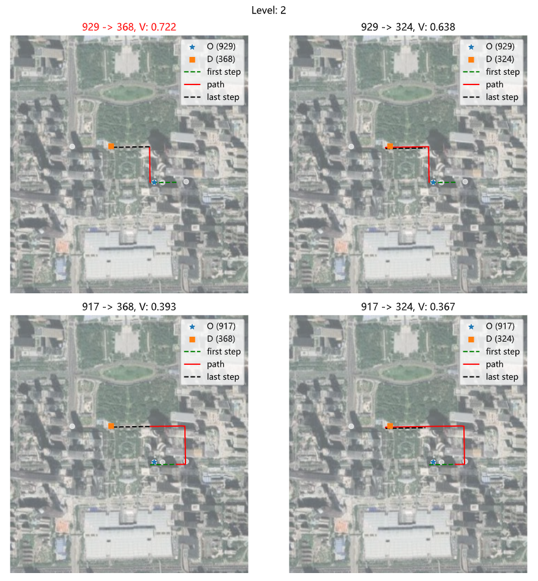

# MatchGPS2OSM

主要针对低采样率的GPS轨迹提出一种新颖的全局地图匹配算法，称为ST-Matching，其考虑两方面：

1. 道路网络的空间几何和拓扑结构

2. 轨迹的速度/时间约束。基于时空分析，构建候选图，从中确定最佳匹配路径。

总体效果图

分层示意图

## Ref

- matching
[Map-Matching for Low-Sampling-Rate GPS Trajectories](https://www.microsoft.com/en-us/research/publication/map-matching-for-low-sampling-rate-gps-trajectories/)
[Map-Matching for Low-Sampling-Rate GPS Trajectories 中文解读](https://blog.csdn.net/qq_43281895/article/details/103145327)
[Matlab算法案例--- 基于隐马尔科夫模型(HMM)的地图匹配(Map-Matching)](https://zhuanlan.zhihu.com/p/108804163)

- batched compression algorithm
[轨迹数据压缩的Douglas-Peucker算法](https://zhuanlan.zhihu.com/p/136286488)
[基于MapReduce的轨迹压缩并行化方法](http://www.xml-data.org/JSJYY/2017-5-1282.htm)

- probability distribution
  
