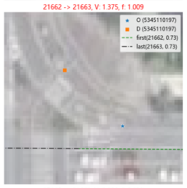

# Changelog

## [Unreleased]

- [x] 自动化测试脚本，包括`性能`和`精度`
- [x] lcss 轨迹相似度评估函数
- [x] matching 轨迹压缩
- [x] 中断处理，match/viterbi.py
- [x] 球面坐标 -> 投影坐标，一系列的变更工作
- [x] 线形的中间过程使用 numpy, 而非 LineString
- [x] linear referencing 矢量化操作
- [x] 可视化模块，投影坐标统一
- [ ] 控制多进程，支撑在windows下运行 :star:
- [x] 中间过程，探讨 geom 是否有必要，减少非必要计算的开销
- [ ] 双向 A* 最短路算法，纠正
- [ ] ALT 算法，加速最短路搜索速度
- [ ] resmaple 使用矢量算法
- [ ] `GeoGraph` aligned to `networkx` :star:

## [V2.0.8] - 2023-12-22

### Added

- mapmatching/geo/ops/distance.py
  - `cal_pointwise_distance_geoseries`(原函数名 geoseries_distance), 计算两个 GeoSeries 点序列的距离，输出为 n 
  - `cal_distance_matrix_geoseries`, 计算两个 GeoSeries 点序列两两之间的距离，输出大小为 n x m

## [V2.0.7] - 2023-5-24

### Added

- mapmatching/match/candidatesGraph.py

  - get_shortest_geometry

    Generate the shortest path geometry based on the given step_0,  step_1 and step_n.

### Changed

- mapmatching/match/**viterbi**.py

  - find_matched_sequence

    函数参数增加：prune_start_layer

  - prune_layer

    <u>更正剪枝算法</u>，将根据 `局部概率` 剪枝更改为 `全局概率` 剪枝

- mapmatching/match/**candidatesGraph**.py

  - identify_edge_flag: 

    querying SP distance from candidate $C_n$ to $C_{n+1}$, 

    针对 $C_{n+1}$ 和 $C_{n}$ 落在同一个 edge上，针对 $C_{n+1}$ 的投影节点相对 $C_n$ 靠前且在阈值内（5 米）的情况，仍然视为 `CANDS_EDGE_TYPE.SAME_SRC_FIRST` 

- mapmatching/match/**spatialAnalysis**.py

  - cal_dist_prob

    针对 $C_{n+1}$ 的投影节点相对 $C_n$ 靠前且在阈值内（5 米）的情况，将 `dist_prob` 手动设置为 1

  - cal_temporal_prob

    增加考虑 np.inf 和 0 两种特殊边界，统一替换为 `1e-6`

- mapmatching/match/**postprocess**.py

  - transform_mathching_res_2_path： 增加原位于 matching 模块的转换代码
  - project： 增加原位于 matching 模块的 Project points onto a matching path 代码

- mapmatching/match/**visualization**.py

  - plot_matching_debug_subplot：修改绘图的样式
  - plot_matching_result：增加原位于 matching 模块的 info 信息展示的代码

- resample_point_seq：存在相同节点的情况，需一开始去重操作，避免 `pd.cut` 报错

- mapmatching/osmnet/parse_osm_xml.py

  - neg_od_set 增加处理边界，但值不为 None 时才需要增加反方向路段

### deprecated

- mapmatching/match/misc.py
  - merge_step_geoms
  - get_shared_linestring
  - _merge_steps
  - merge_coords_intervals_on_same_edge

## [V2.0.6] - 2023-4-19

### Added

- mapmatching.matching 

  增加当 candidates 为 None时，检查 bbox 是否覆盖轨迹的边界判断条件

- geopraph.search 增加返回平均速度

- match.postprocess.get_path 增加返回`最短路距离`和`平均速度`

- match.spatialAnalysis

  - cal_temporal_prob 计算子轨迹的平均速度

- osmnet.parse_osm_xml

  - 路网解析新增 speed 字段

## [V2.0.5] - 2023-4-14

### Added

- mapmatching/graph/geograph.py
  - 新增 `add_edge_map` 函数，将原来的可视化程序解耦

### Changed

- 修复一些 Bugs

  - ST_Matching.matching 中 绘图所使用的GeoDataFrame 存在没有初始化 crs

    让本来经纬度坐标的直接绘制在投影坐标的图上，导致图的比例尺特别大

  - candidatesGraph L97 数值溢出问题

  - mapmatching/osmnet/twoway_edge.swap_od 空 dataframe 的处理

## [V2.0.4] - 2023-4-9

### Changed

- requirement.txt 新增必要依赖库


## [V2.0.3] - 2023-4-7

### added

- 增加预处理路网:
  - 深圳市南山区留仙洞片区 `./data/network/LXD_graph.ckpt`

### Changed

- demo.py
  - 示例代码 `demo.py` 默认加载预处理路网

## [V2.0.2] - 2023-3-23

### added

- demo.py
  - 示例代码增加将轨迹节点投影到匹配道路步骤

### Changed

- 修改原输出 dict 中 `step_0` 和 `step_n` 的含义，
  从原来的`坐标序列`改成投影点相对整段道路的`偏移百分比`

## [V2.0.1] - 2023-3-7

### Added

- geo
  - linear_referencing_vector
    - 矢量化操作，支持`（点、线）`对的操作
  - to_array
    - geoseries_to_coords, 使用 numba 加速 for 循环
  - distance
    - get_length：通过 `estimate_utm_crs` 转换到合适的投影坐标，然后计算线形的长度

### Changed

- geo.query.get_k_neigh_geoms
  - 增加对齐 query 和 gdf 的操作，避免坐标不同意造成的错误

## [V2.0.0] - 2023-2-23

### Added

- geo
  - distance
    - geoseries_distance
    - coords_seq_distance
    - get_vertical_dist
  - linear_referencing
    - linear_referencing
    - closest_point_on_segment
  - to_array
    - points_geoseries_2_ndarray
- GeoGraph
  - align_crs
  - to_wgs
  - to_proj
- match
  - misc
    - get_shared_arr
    - get_shared_line
    - merge_geom_steps：连接三段 geometry 要素

### Changed

- GeoGraph

  使用 `投影坐标`，而非`球面坐标`，解决长度计算不准确的问题

- metric

  - DP 算法中的 for 循环使用 numba 加速

## [V1.3.7] - 2023-2-15

### Added

- geo.ops.point2line: 基于 shapely 的 linear referencing 的功能重构
  - project_points_2_linestring: 将点集投影到折线上
  - project_points_2_linestrings: 将点集投影到最近的折线上
  - cut_linestring: 根据 offset 切分折线
- geo.vis
  - plot_points_with_dir
- geo.haversineDistance
  - haversine_geoseries
- geo.query
  - get_K_neigh_geoms: 基于 geopandas 的query_bulk 的基础上，加上一些分析

- graph.geograph
  - GeoLLDiGraph: 支持球面坐标和投影坐标的转换

### Changed

-  geo.metric.lcss 通过 numba 加速 dp 矩阵的遍历
-  ST_Matching
   - project：调用重构的`project_points_2_linestrings`

## [V1.3.6] - 2023-2-13

### Added

- `cal_coords_seq_azimuth`
- `plot_linestring_with_arrows`

### Changed

- ST_Matching

  matching 函数 , 在`check_topo` 参数为正的时候，将检查拓扑，若发生纠正拓扑，则返回纠正后的匹配结果

- check_steps

  增加 status 为 4 时候的边界，后续需要重构代码

## [V1.3.5] - 2023-2-3

### Added

- ST_Matching

  matching 函数 增加`check_topo` 参数用于控制检测 topo 信息是否有误

- geo.io

  `sqlalchemy 2.0.0` 版本和 Postgresql 的交互

- match.visualization

  debug_gt_level_parallel, 支持并行化绘制子图

  merge_imgs_np, 以 grid 的将子图合并成大图

### Changed

## [V1.3.4] - 2023-1-31

### Changed

- geo.haversineDistance.haversine_vector_xy

- geo.pointToLine.project_point_2_line

  使用 `shapely`的 [linear reference](https://shapely.readthedocs.io/en/stable/manual.html#linear-referencing-methods)

- osmnet.parallel_offset_edge

  因 shapely 升级到 2.0 后接口有所调整，增加版本控制逻辑

## [V1.3.3] - 2023-1-20

### Added

- geo.osps.check_duplicate_points， 检测坐标序列中是否存在重复的节点

### Changed

- resample_point_seq

  增加边界条件：`仅有一个节点`的情况

- cal_linestring_azimuth_cos_dis

  增加边界条件：weights 的和为 0 的情况，如两个重叠节点

- mapmatching.match.candidatesGraph._cal_traj_params

  增加检测重复节点的逻辑

- mapmatching/match/spatialAnalysis.**cal_dist_prob**

  梳理 落在同一个路段上的两种情况增强因子, 初定为{1: 1.02, 2: 1.01}

## [V1.3.2] - 2023-1-20

### Added

- `mapmatching/match/geometricAnalysis.get_k_neigbor_edges` 增加识别没有candidates 的点

- mapmatching/match/viterbi.find_matched_sequence

  - prune_layer：使用 heapq 逻辑，耗时为原来的 1/3 ~ 1/2 

  - reconstruct_path： 支持 HMM 中断后，还原路径

### Changed

- `data/trajs` 测试数据样例的数据从 epath 切换成 vpath，减少因为不同网络初始化对于结果的影响
- `mapmatching/match/viterbi`
  - find_matched_sequence: 支持处理**中断**情况
  - reconstruct_path：还原 epath
  - get_max_state
  - prune_layer:  beam search 中的剪枝操作
- mapmatching/matching.match 增加 metric 参数控制评估与否

## [V1.3.1] - 2023-1-17

### Added

- `graph.geograph.GeoDigraph`
  - split_edge

- `graph.base.Digraph`
  - transform_epath_to_vpath
  - transform_vpath_to_epath

- `update_network`
  - check_steps: 根据 mapmatching 的结果判断是否存在异常匹配的区间，进而判断`拓扑错误`或者`道路缺失`的情况

### Changed

- osmnet.parse_osm_xml
  - _parrallel_collect_geoms, 并行处理获得 edge 的 geom
- `graph`
  - PathPlanning: `check_od` -> `has_edge` 
- `match.spatialAnalysis.cal_dist_grob`
  - 增加边界 gt.empty 逻辑
  - Penalize slightly shorter paths， 增加一个系数 1.01，当 gt.d_euc / gt.w > 1.01 时候，才会 0.95 / dist

- `geo.azimuth.cal_linestring_azimuth_cos_dist` 增加考虑边界因素，即 weight 为空列表的时候，调用 np.average(lst, weights=weights)  出错

## [V1.3.0] - 2023-1-11

### Added

- `GeoDigraph`
  - add_edges_from_df
  - remove_edge
  - get_eid(src, dst) 通过 src 和 dst 获取 eid

### Changed

- `GeoDigraph`

  - graph 和 od_2_eid 的属性合并

    graph 存储一个 字典，目前设有 eid 和 cost；原 graph 存储 cost， od_2_eid 存储 eid

  - `transform_node_seq_to_edge_seq` 更名 `transform_vpath_to_epath`

  -  transform_edge_seq_to_polyline -> transform_epath_to_linestring

  - search 返回值 属性变更，epath，vpath，path分别代表 途径的边，途径的点，规划路径的 geom(含 first_step 和 last_step)

- astar

  - search 返回值 属性变更，默认返回 vpath

- match

  - cal_dist_prob： 针对`纠正 gt 两个点位于同一个路段上` 时候 epath 和 vpath的修改

- pase_osm_xml

  - parse_xml_to_graph 抽象成若干个子函数
    - _parse_xml
    - _simplify_edges
    - _add_revert_edges
    - _process_multi_edges
    - _transform_coords_seq_2_linestring
    - edge_offset
    - append_way_info

## [V1.2.9] - 2023-1-5

### Added

- 使用地图匹配反向作用提升众包数据质量
  - 拓扑关系纠正：增加反向车道

- trajResample
  - 轨迹等距离采样，使得新生成的坐标点序列的距离为等差数列，便于计算轨迹距离
  - 支撑两种模式：resample_trajs_points_to_points 和 resample_trajs_polyline_to_points
- Digraph
  - `od_2_eid`, `eid_2_od`
  - eid 递增
- GeoGraph
  - add_reverse_way
  - `get_pred_edges`, `get_succ_edges`: 获取上下游的路段

### Changed

- Tilemap 所有接口统一挪到 visualization

- `ST_Matching`中 eval 支持 轨迹的重采样

- spatialAnalysis 中 `cal_dist_prob` 

  纠正 gt 两个点位于同一个路段上，且 src 相对 dst 靠前情境下`w`的计算 `gt.last_step_len + gt.first_step_len - gt.dist`


## [V1.2.8] - 2023-1-4

### Added

- graph 增加 level 信息
- `check_multi_edges` 检测 及 后处理
- `setting`增加 osm_highway_type_dict, link_type_level_dict 

## [V1.2.7] - 2022-11-30

### Added

- `CANDS_EDGE_TYPE`: NORMAL、SAME_SRC_FIRST、SAME_SRC_LAST

### Changed

- get_k_neigbor_edges
  性能优化，直接使用 index 获取 DataFrame，而非使用 merge，节省时间级别为`十毫秒`级别
- `postprocess`
  - 性能优化，直接使用 index 获取 DataFrame，而非使用 merge
  - 轨迹压缩，改变输出结果，将原来输出 edge 的 geodataframe 变更为 {eids， step_0， step_n， prob}
- ST_Matching
  - 适配 matching 输出的变化
  - `transform_res_2_path`

## [V1.2.7] - 2022-11-30

### Added

- `mapmatching/geo/haversineDistance.py`

  cal_points_seq_distance 计算坐标序列的长度

  merge_coords_intervals_on_same_edge 合并坐标序列区间

- match

  - matching 部分代码子函数化
  - plot_result 增加概率展示信息

### Changed

- douglasPeucker

  修改压缩两个节点的阈值， 1e-4 - > 1e-6

- 纠正 `trajs/gt.json` 测试数据序列信息

- match

  - matching 部分代码子函数化

    - plot_result 增加展示

  - postprocess.get_path

    修改 `eids_lst` 的计算逻辑以及去重逻辑

    增加 `dir_prob` 概率计算模块

  - spatialAnalysis

    - merge_steps ，完善 flag==1 情况下的 coords 的计算方式
    - cal_dist_prob，完善 flag==1 情况下，dist_prob的计算方式


## [V1.2.6] - 2022-11-30

### Added

- ST_Matching
  - `matching` 新增匹配概率的计算
  - 返回增加: status, prob, trans_prob, dist_prob, dir_prob

- CODE 匹配状态码
  - 0  成功匹配；
  - 1 所有节点位于同一条线上；
  - 2 所有节点位于同一个点上； 
  - 3 没有候选节点；
  - 4 匹配结果，prob低于阈值
- Geograh 支持 Bidirection Astar
  - 但没有通过测试集的测试，需要 debug 优化


## [V1.2.5] - 2022-11-28

### Added

- ST_Matching
  -  `project_traj_points_to_network`
  -  load_traj

### Changed

- Astar 最短路算法 封装成类

## [V1.2.4] - 2022-11-23

### Added

- `ST_Matching` 模块的新增 `_simplify`，`eval`函数
- 增加`metric`模块，计算轨迹间的相似度，目前包括：lcss，edr， erp
- `project_point_to_polyline` 增加 `projection point` 属性
- `haversine_matrix `增加 `cal_haversine_matrix` 矢量化计算距离矩阵
- `build_geograph` 新增支持上传至 数据库 

### Deprecated

- 原 `haversine_np`弃用，因最新版本的 haversine 内置 haversine_vector

## [V1.2.3] - 2022-11-20

### Changed

- 将整个模块打包成 package，外部可直接调用
- `candidatesGraph.py` construct_graph 将原来构建层级的逻辑拍平，直接矢量化生成

## [V1.2.2] - 2022-11-10

### Added

- 新增最短路测试用例`./data/trajs`
- 新增`eval.py`, 自动化测试数据集的`性能`和`精度`

### Changed

- 优化`data`文件夹的目录结构
- `a_star`最短路算法异常返回值 waypoints 从 `None` -> `[]`
- `construct_graph`将 index 设置为 ['pid_0', 'eid_0', 'eid_1']
- `cal_dist_prob` 简化代码，通过矢量化操作去循环

## [V1.2.1] - 2022-11-8

### Added

- 使用`os.environ["USE_PYGEOS"] = "1"`矢量化操作 sindex.query

- timer 模块增加`timeit`装饰器评估函数运行时间

- `azimuthAngle_np` 增加矢量化计算方向角

- 重构`find_matched_sequence`

  按照 beam search 算法优化

## [V1.2.0] - 2022-11-3

### Changed

- `a_star`最短路算法，完善异常输入的返回值`{'path': None, 'cost': np.inf,}`

  - graph 中不存在某个节点的边，如：以`单向道路终点`为出发点的请求

- candidatesGraph

  将原来计划轨迹属性的部分从spatilaAnalysis部分转移

  - `_identify_edge_flag`：
    - 判断
      - `(src, dst)`是否落在同一个edge上
      - src 和 dst 的先后顺序
    - 处理：对调 flag == 1 的 src 和 dst
  - cal_traj_params
    - d_euc
    - move_dir

- geometricAnalysis

  - analyse_geometric_info 

    `edge_keys` 变更为`[]`, 因为对于同一个 eid 中的不同路段，最优的候选路段不一定是最近的路段

  - cal_observ_prob

    在原有的基础上开根号处理，降低对距离的敏感度

- spatialAnalysis

  - merge_steps：合并 step_0 + wayedges + step_n
  - `cal_dist_prob`  
    - flag == 1的情况，将 `v`设置为 1
  - `cal_dir_prob`
    - 方向角相似性， 考虑 step_0 + wayedges + step_n
    - flag == 1的情况，将 `dir_prob`设置为 1

- visualization

  - 纠正子图显示的位置

## [V1.1.9] - 2022-10-31

### Added

- `GeoDigraph`
  - `transform_node_seq_to_edge_seq`，通过 eid 快速访问edge，加快还原轨迹的速度
  - `transform_edge_seq_to_polyline`
- candidatesGraph
  - 新增`same_edge`的判断


### Changed

- `GeoDigraph` 
  - search 函数，增加 `eid_list` 和`geometry`属性
  - get_edge, get_node, _get_feature函数，增加 reset_index 控制
- `postprocess`
  - 将原来 edge的访问索引`(src, dst)` 更改为 `eid`

- `spatialAnalysis`
  - _trans_prob, 新增(o, d) 位于同一 edge 上的处理方式


### Deprecated

- `GeoDigraph`
  - transform_node_seq_to_polyline
  - transform_node_seq_to_df_edge


## [V1.1.8] - 2022-10-27

### Changed

- `project_point_to_line_segment`接口修改，输入为`points, edges, keep_cols`
- `postprocess`轨迹还原处理模块重构
- `parse_xml_to_graph`增加 index 和 eid 顺序一致性的判断

### Fixed

- `sindex.query`查询问题修正，index 的值为 item 在数据框中的序号，而非其真正索引的 `index`

## [V1.1.7] - 2022-10-24

### Added

- `db_process` 增加 PostgreSQL 支持

### Changed

- `ST-MapMatching` 重构，将各个模块的功能进行拆分

  ```log
  ├── __int__.py
  ├── candidatesGraph.py
  ├── geometricAnalysis.py
  ├── postprocess.py
  ├── spatialAnalysis.py
  ├── temporalAnalysis.py
  ├── topologicalAnalysis.py
  ├── visualization.py
  └── viterbi.py
  ```

- astar 的 memo 经测试，耗时可以降低 2 个数量级

- 统一 `parse_osm_xml`的 df_edges `eid` 和 `index`值 

## [V1.1.6] - 2022-10-19

### Changed

- 将 `spatial_analysis`相关部分从 ST_Matching 中抽离


## [V1.1.5] - 2022-10-19

### Changed

- 将 `get_k_neigbor_edges`(即原 get_candidates) 从 ST_Matching 中抽象出来
  - 针对一般场景，耗时在 `十毫秒` 级别
  - sindex.query(bbox, predicate='intersects'), 经过测试，`feature` 在 `bbox` 内部/相交 都是支持的，详见 `./test/0_shapely_空间关系.ipynb`

- `ST_Matching` 适配 `get_k_neigbor_candidates` 算法


## [V1.1.4] - 2022-10-18

### Added

- `GeoDigraph` 增加 对象序列化功能

  - save_checkpoint
  - load_checkpoint

- `osmnet` 模块

  - 新增 `build_graph` 模块，通过 osm 文件快速获得 路网的图信息

- `utils` 中 `serialization` 子模块

  新增 `save_checkpoint`， `load_checkpoint` 

### Changed

- `matching` 适配新路网格式，主要是边 的起点 `(s, e)` -> `(src, dst)`


## [V1.1.4] - 2022-10-13

### Changed

- 将原来 DigraphOSM 分为 `OSM 预处理的部分` 和 `图论算法部分`
  - 其中图论部分抽象为 `GeoDigraph`
  - OSM预处理模块按照模块拆分至 `osmnet `模块
- `graph`模块：将图论相关模块抽象
  - `base.py`: Node, Digraph
  - `geograph.py`: 原来 DigraphOSM 图论通用模块下沉至本模块 
  - `bfs`：A* 算法
- `osmnet`模块
  - osm_io: 数据加载模块
  - parse_osm_xml: 修改 edge 和 node 提取的属性
  - twoway_edge: 针对识别双向道路，并进行一定程度的偏移

## [V1.1.3] - 2022-10-10

### Added

- 新增`osmnet` 模块

  - combine_edges：将和 edge 合并相关的代码抽象合并在一起

    为了提升最短路算法搜索的步长，将节点的入度和出度均为1的边和上下游合并

    使用默认的 way 的方式会导致 graph 不齐全，`(o=7959990710, d=499265789)` :arrow_left: 拆分为最小单元，然后再次合并

  - downloader：osm xml 下载模块

  - parse_osm_xml

    使用 pyosmium 模块解析 OSM 文件，加快提取 graph 的处理速度


## [V1.1.2] - 2022-10-08

### Added

- 增加基于瓦片编号规则的 `fishnet`

### Fixed

- DigraphOSM
  - 考虑 节点数据 没有 `traffic_signals`情况
- parallel_process
  - 支持 tuple 作为 输入
  - total 控制进度条的长度


## [v1.1.1] - 2022-05-09

- 增加测试轨迹输入，存储路径为 `./input`
- MapMathching
  matching 增加仅有一个 candidate points 的边界条件
- azimuth_diff
  修复角度夹角大于 180 时计算错误的情况
- point_to_polyline_process
  返回值增加`点`到`折线`的`距离`

## [reconsitution] - 2022-05-09

- 封装`DigraphOSM` 和 `ST_Matching`
- geo_helper 增加 `point_to_polyline_process`
- osm_helper 增加 `download_osm_xml`, `parse_xml_to_topo`, `combine_links_parallel_helper`

## [V1.1] - 2022-01-25

- 修复预测bug

## [1.0.11] - 2021-12-23

### Changed

- matching.py
  - find_matched_sequence
    - 优化针对某些场景，gt下标出错的情景
    - f_score中查找最大值优化

- setting.py
  - filters 中去掉 service（相当于连接线）

## [1.0.10] - 2021-09-23

### Changed

- `DigraphOSM.py`
  - net.df_edges: change `index` -> `eid`
  - to_csv

## [1.0.09] - 2021-09-23

### Added

- `azimuth.py`
  - azimuth_cos_similarity_for_linestring(geom, dir, weight=True)

### Changed

- `matching.py`
  - add log for candidates

## [1.0.08] - 2021-09-13

### Changed

- `matching.py`
  - `matching_debug_subplot` add transition probability
- `douglasPeucker.py`
  - `dfs` change the passes parameter from `array` to `subscript`
    - to cut down the continuity point and raise the compression rate.
  - `dp_compress_for_points` for trajectory points compression.
- `azimuthAngle`
  - fix speail case: [(0, 0), (0,1)]

## [1.0.07] - 2021-09-08

### Changed

- DigraphOSM
  - upload_topo_data_to_db: upload `indegree` and `outdegree` osm point version to db
- matching
  - move gba trajectory tesing to `matching_testing.py`
  - `find_matched_sequence` delete the `drop_dulplicates` part, for it would ignore a choice beteen levels.
  - `get_candidates` add `shrink` parameter to check candidates in consecutive levels is the same or not, and then delete the dulplicate level.
  - `combine_link_and_path` add parameter `net`

## [1.0.06] - 2021-07-27

### Changed

- matching.py
  - cal_trans_prob
    - Adjust the caculate functions, + 'np.abs'
    - adjust the ratio, when the ratio is bigger than 1, than `factor = 1/ factor`
      
    - Add azimuth to transmission probability.
      

## [1.0.05] - 2021-07-27

### Added

- Digraph_OSM
  - Topo edge data: add `dir`

### Changed

- matching.py
  - get_candidates
    take `dir` into accounts.
  - cal_relative_offset
    Change calculation logic
    - caculate the closest line
    - caculate the accumulative distance from the start point to the foot point
  - cal_trans_prob
    `_od_in_same_link`: Analyzed the cases that the cotinuos candidates are located on the same link

## [1.0.04] - 2021-07-24

### Added

- Digraph_OSM
  - node_sequence_to_edge

### Changed

- `mathing.py`
  - linestring_combine_helper
    In `cal_trans_prob`, there is no need to obtain geometry.
  - get_path
    Reconstruct path according to the resualt of the  `find_matched_sequence`.
  - the find best sequence: add the observ probility
  - matching_debug_subplot
    add observ prob, v, f details.

## [1.0.03] - 2021-07-22

### Added

- Douglas-Peucker / trajectory segmentation (Batched Compression Techniques)
- load path_set of direction API for matching testing.
- `mathing.py`
  - add visulization
  - completed the pano matching frame
- `geo_helper.py`
  - foot related functions
  - edge_parallel_offset
    - Add judgment conditions: `is_ring`
  - io related functions: load/upload postgis
- `geo_plot_helper.py`
  - adaptive_zoom_level
- `log_helper.py`
  - log to file/std

### Changed

- DigraphOSM
  - Encapsulated it as a separated module.
  - `add_reverse_edge` add `is_ring` judgement condition to determine add the reverse edge or not.

## [1.0.02] - 2021-07-19

### Added

- Digraph_OSM
  - download_map from the Internet
  - way_filters['auto']
  - add_reverse_edge: add reverse edge of two-way road. The order of reverse edge is [-1, -2, .., -n-1], where n in the number of line segments.
  - A star 增加终止条件; Add `max_layer` parameter to control the deepest level.

- PickleSaver
  - Save the object to file, and load the object from the file.

- setting.py
  - Define `way_filters['auto']`

### Changed

- matching.py
  - cal_relative_offset
    Update the calculation process
  - st_matching
    plot with more details

## [1.0.01] - 2021-07-15

### Added

- Digraph_OSM
  - 创建类，实现自动从OSM解析路网
  - 合并出入度都为1的edge

- matching.py
  - 实现空间匹配算法
  - 路网匹配，可视化debug

- coordTransfrom_shp
  实现geopandas的坐标转换

- foot_helper
  和垂足相关的脚本